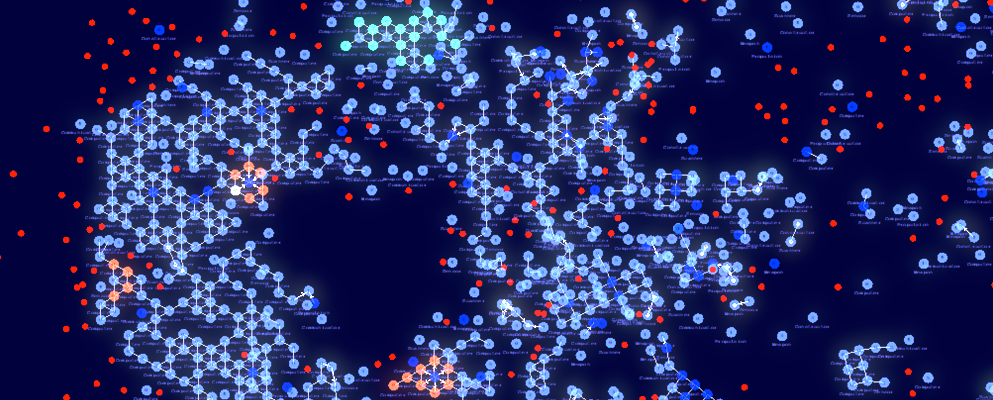

<h1 align="center"><a href="https://alien-project.org" target="_blank">ALiEn - Explore the world of artificial life</a>.</h4>

ALiEn is a GPU-accelerated physics engine focused on demands for artificial life computations. It contains a software tool designed to simulate digital organisms embedded in artificial ecosystems and to mimic conditions for (pre-)biotic evolution.

The software features
- realistic physical computations of kinematic and thermodynamic processes of damageable and glueable rigid bodies 
- programmable matter for simulating digital organisms and evolution 
- built-in graph editor for designing own machines 
- simulation and rendering on GPU 

	

For further information and artworks please also visit
* [Website](alien-project.org)
* [YouTube](https://youtube.com/channel/UCtotfE3yvG0wwAZ4bDfPGYw)

## Documentation
Please visit [alien-project.org](https://alien-project.org/documentation.html) for a comprehensive documentation of the program and the underlying model.

## How to build
You can build alien using Microsoft Visual Studio 2015 or higher. The solution file is contained in msvc/Gui/alien.sln. The following external libaries are necessary:
- Qt 5.8 or higher
- boost library [version 1.65.1](https://www.boost.org/users/history/version_1_65_1.html) should be installed in external/boost_1_65_1 of the repository
- CUDA 9.0
- gtest framework is already contained in the repository in external/gtest

## Installer
There is also a Windows installer with 64 bit binaries available at [alien-project.org](https://alien-project.org/downloads.html).

##License
alien is licensed under the [GPLv3](LICENSE).